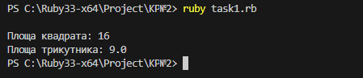
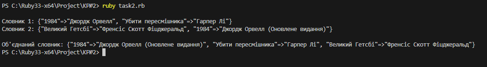

# Контрольная робота №2

## Завдання 1: Створення класу Figure та його наслідування

### Умова:
Створіть базовий клас `Фігура`, який містить метод для обчислення площі. Реалізуйте наслідування для класів `Квадрат` та `Трикутник`, додайте методи для обчислення їхніх площ.

### Код:
```ruby
class Figure
  def area
    raise NotImplementedError, "Метод 'area' має бути реалізований у підкласі"
  end
end

class Square < Figure
  def initialize(side)
    @side = side
  end

  def area
    @side * @side
  end
end

class Triangle < Figure
  def initialize(base, height)
    @base = base
    @height = height
  end

  def area
    0.5 * @base * @height
  end
end

square = Square.new(4)
puts "\nПлоща квадрата: #{square.area}" 

triangle = Triangle.new(6, 3)
puts "Площа трикутника: #{triangle.area}"
```
### Результат виконання:
Після виконання цього коду програма обчислює площу квадрата та трикутника й виводить їх у консоль. 

Результат виконання:


---

## Завдання 2: Реалізація перевантаження оператора `+` для класу Словник

### Умова:
Реалізуйте клас `Словник`, який дозволяє зберігати пари ключ-значення та підтримує об'єднання двох об'єктів за допомогою перевантаження оператора `+`. Якщо ключі співпадають, у результаті повинно залишитися значення з другого словника.

### Код:
```ruby
class Dictionary
  attr_reader :data

  def initialize(entries = {})
    @data = entries
  end

  def +(other)
    merged_data = @data.merge(other.data)
    Dictionary.new(merged_data)
  end

  def to_s
    @data.to_s
  end
end

dict1 = Dictionary.new({
  "1984" => "Джордж Орвелл",
  "Убити пересмішника" => "Гарпер Лі"
})

dict2 = Dictionary.new({
  "Великий Гетсбі" => "Френсіс Скотт Фіцджеральд",
  "1984" => "Джордж Орвелл (Оновлене видання)"
})

merged_dict = dict1 + dict2

puts "Словник 1: #{dict1}"
puts "Словник 2: #{dict2}"
puts "Об'єднаний словник: #{merged_dict}"
```
### Результат виконання:
Після виконання цього коду програма об’єднує два словники та виводить у консоль дані кожного словника окремо, а також об'єднаний результат.

Результат виконання:

